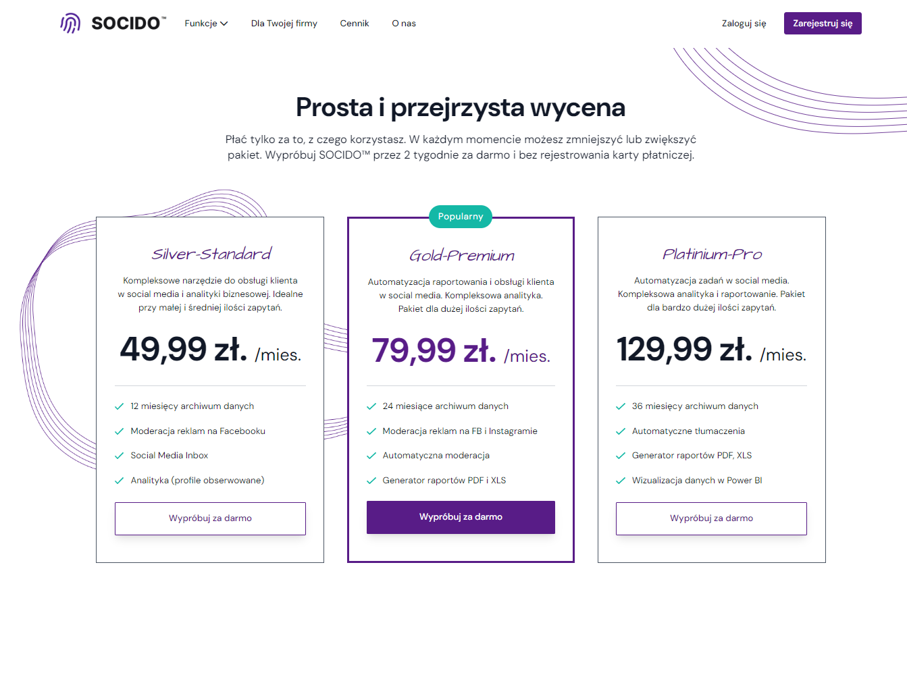
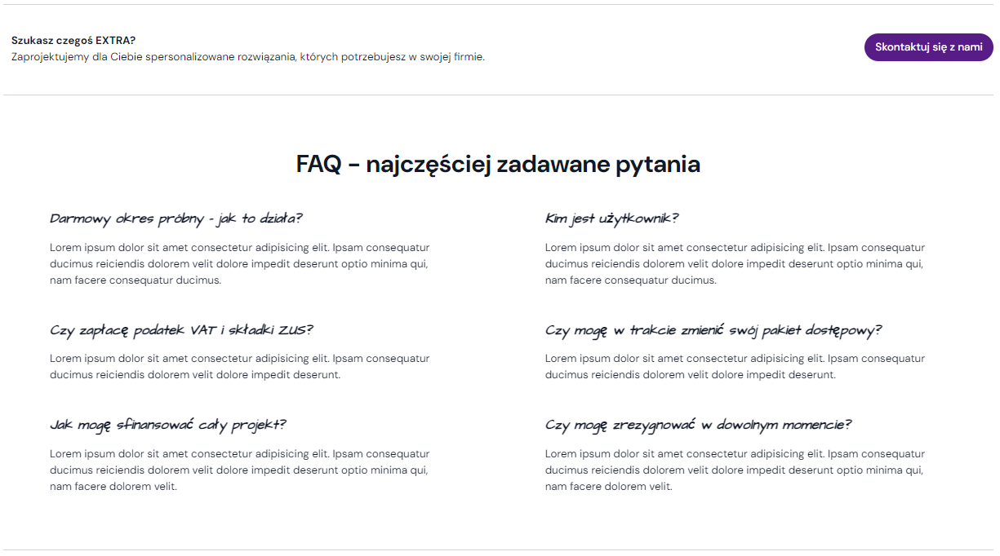
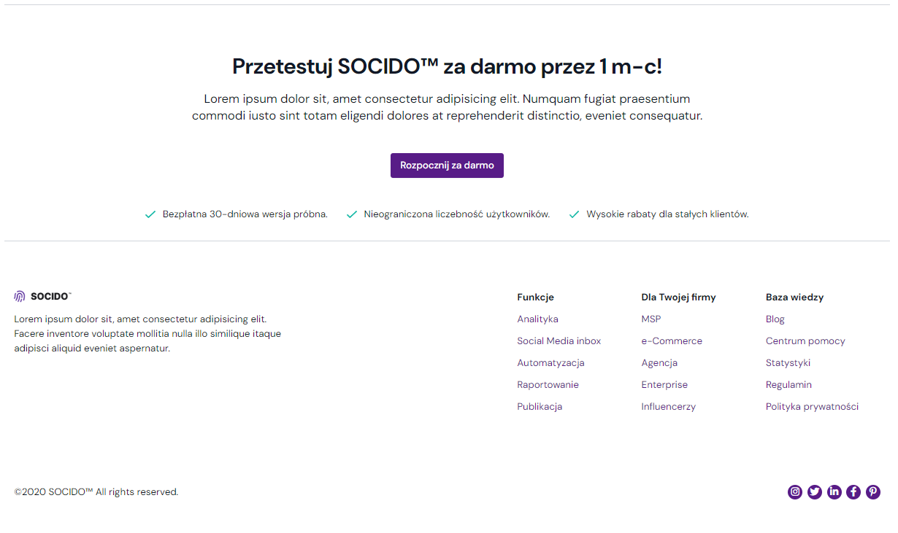

# SOCIDO - company website.

### Website with subpages and a drop-down menu as a business card of the company with a description of the basic areas of activity and a price list.

## The goal of the project.

The project is an example of using the Tailwind CSS framework to quickly build a website without using typical CSS or SCSS styling.

## Technologies Used:

- HTML,
- Tailwind CSS (frontend framework),
- JavaScript,
- Parcel bundler,
- Git,

## Tools:

- Node.js,
- NPM & dependences,
- Gulp.js & extensions,
- AOS (Animate On Scroll library),
- VSC (Visual Studio Code),
- Netlify

## Setup:

To run this project, start it in root directory using:
'npm run start'

## Screenshots

Example screenshots:

## Features

- Parcel bundler configuration.
- Tailwind setup.
- Using Tailwind CSS classes.
- JS scripts.
- Use of graphics and photos.

[def]: ./src/img/screenshots/3_start_webside.png
